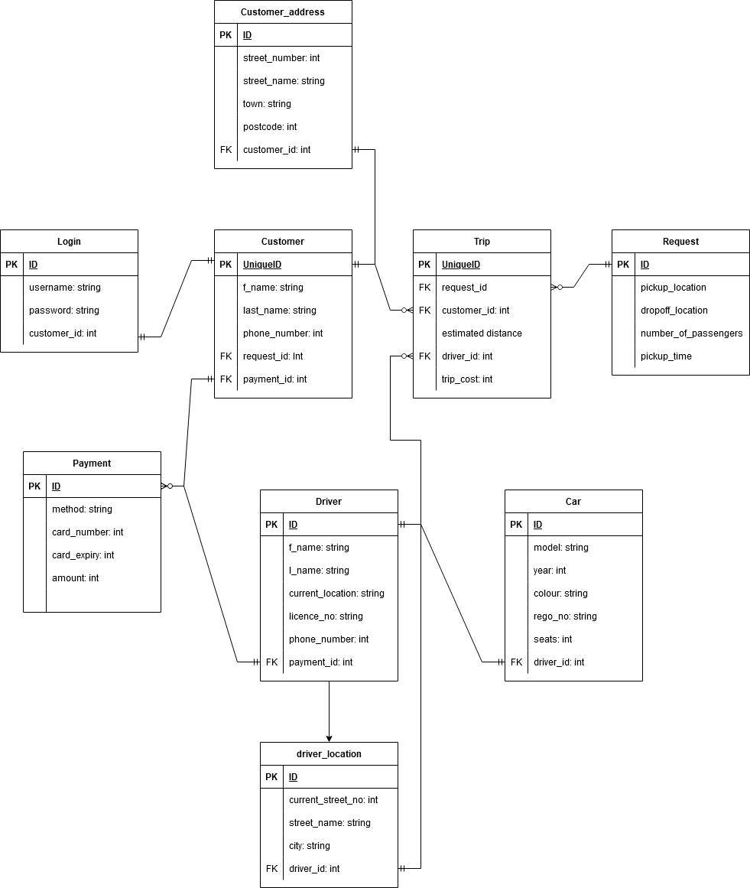

# T2A1 Workbook (Part A)

By Nicole Hulett

## Q1. Describe the architecture of a typical Flask application


Flask is a web framework for making applications on the web. The architecture of Flask can utilise the MVC (Model/View/Controller) paradigm or has the freedom for the code to be structured in different ways. As Flask uses the Python language, applications are well organised if they use the modularisation technique to keep the code neat and tidy and all similar code together. 

An important part of any Flask application is the configuration file (config.py). This file or area within the code of the application creates the connection to the databases and security systems. 

There is also a main python file (main.py or app.py) that is essential for getting the application running. This file imports all the necessary packages and creates the objects for these packages. A function is also defined that creates the application.

A part of the Flask structure using the MVC design is Models. This refers to creating database models that represent the tables or entities in a database. These models also include all the information and constraints for the attributes which are defined in the columns of a database table. These models can be stored in a separate ‘models’ directory in their own python file according to entity. 

The second part of the MVC design is Views. Views is typically how data is presented in an application. In Flask, schemas are developed with the use of the Marshmallow package to convert the data obtained from databases to the required Json format in key value pairs. 

Finally, Controllers are the last part of the MVC structure. Controllers are developed in Flask to match incoming requests with the correct URL and defined route. Controllers are also responsible for returning the response for that request. Controllers are a part of the application that can define the properties of routes and behaviour of certain features. These routes consist of a function and a return statement. The routes represent the CRUD operations of Create, Read, Update and Delete. The app route must define the HTTP methods to be used, for example GET, POST, PUT or DELETE. 

Flask applications are also able to utilise Blueprints. These Blueprints are helpful for larger applications. Blueprints can better organise the functionality aspects of different features of the app (Krishna, 2022). Blueprints create components that can be re-utilised. In code, you need to define the Blueprint, define the routes with the Blueprints and register the Blueprints with the application. 

Another feature of a Flask application is the ability to create commands for the application to create, seed and delete databases. Also, a requirements.txt file will also be included in the application to list all the packages needed to make the application run. 

Flask is a popular web framework for Python developers. The architecture can be simple or more complex depending on the needs of the project. 

## Q2 Identify a database management system (DBMS) commonly used in web applications (including Flask) and discuss the pros and cons of this database

PostgreSQL is an object relational database management system, originally called Postgres, that continues to gain popularity. PostgreSQL is a free and open-source software that is available for all to use. These days it is being used in many business industries, including; the financial, manufacturing, government geospatial and web technology industries. 

The advantages of using PostgreSQL as a DBMS are many. PostgreSQL can help run dynamic web apps and websites. It is compatible with many different platforms and major programming languages and middleware. As already mentioned, it is an open-source code system, therefore, this allows the user freedom to use, modify and implement it as needed. This system also supports JSON data which is a plus. PostgreSQL can be used for location-based services as it supports geographic objects. Another pro is that in PostgreSQL the developer can execute complex queries. A big benefit is that it is easy to use and a junior developer won’t need much training to be able to utilise this system. (Peterson, 2022) 

The first disadvantage of PostgreSQL is that it is not owned by one organisation and not as well known, even though it is comparable to other database management systems. (Peterson, 2022). The second con is that not all open-source apps support PostgreSQL, there are many that are only compatible with MySQL. A third disadvantage is that PostgreSQL is slightly slower than MySQL in performance. 

Overall, PostgreSQL is a solid choice for a database management system that includes all the main features of a DBMS and more. 

## Q3 Discuss the implementation of Agile project management methodology

Agile project management methodology is a way to manage a project by breaking it up into several different phases. ‘Agile’ meaning iteration, where developers can iterate over and upon the different phases. Each phase requires continuous improvement and constant collaboration with stakeholders. This methodology works off the basis that a project should be continuously improved throughout its lifecycle with changes being made quickly and responsively. To implement agile project management methodology for this project there are many things that the workplace can do, including, daily stand-ups, user stories, Kanban boards, task prioritization and sprints. 

Firstly, implement a daily ‘Stand-Up’ routine. This is a very common practise for this type of project management. Stand-ups require each member of the team of the project to answer three questions similar to this; “What did I work on yesterday?”, “What am I going to work on today?”, “What issues are blocking me?” (Radigan, n.d.). The daily stand-up is a short meeting to discuss progress and identify blockers. This technique is also a way for people to be accountable for their work.

Kanban boards are important for agile projects. Kanban is a visualisation tool that allows all project members to see all tasks across the project at any time. This board doesn’t have time limits. Boards can be made with Jira or Trello. A typical Kanban board will need three columns; ‘To do’, ‘In progress’ and ‘Done’.

One of the main tools to implement in an agile project is ‘Sprints’. Sprints are all about getting the smaller pieces or chunks of the project completed. Sprints should be very defined and focused. Sprints should have a clearly specified time limit or duration. Work should be focused on the in-progress list and every developer in the team should know what work they are doing and be aware of what other team members are working on. Sprints work great with Kanban boards in allowing developers to focus on what needs to be done. At the end of a sprint, a sprint retrospective should also be done. This allows project members to review the sprint and discuss what went well, what could be improved and what they will commit to in the next sprint. 

Another technique for agile project management is ‘User Stories’. User stories relate to the features of a software project. The developer needs to create an informal natural language description from the perspective of an end user. These can also be created by others invested in the project. These user stories should describe the type of user, what they want and why. User stories need only be brief and simple as requirements always change, but it provides a start for team members to work with. See below for an example.

“As a [library borrower], I want to [receive an email when my on-hold books are ready] so that [I can go pick them up]."

Task prioritisation is another handy technique of agile project management. This involves ordering each user story, Kanban card or task to a future sprint to ensure that essential features of the project get completed in a timely and efficient manner. This technique allows the entire team to understand the flow of the project.

Agile project management should include a range of the above techniques that all assist in improving the cohesiveness and efficiency between team members and the project. 

## Q4 Provide an overview and description of a standard source control workflow

Git is a popular and widely used source management system that helps to simplify the development cycle (Laster, 2017). Developers using Git can create, use and switch between branches for content development easily in their daily workflow. It has fast and efficient architecture that allows its users to experiment and refine local changes in an isolated environment before sharing them with others. This is important in managing an organised work environment. The basic flow of a git source control workflow is there is a master branch, developers can create new branches, work on them, commit the changes, use pull requests to update branches, test changes and push a branch to merge it with the remote branch on the master copy. Github is often used in conjunction with Git as it provides the hosting service on a remote server that all the developers can access. 

The first step for most developers starting on a project is to 'git clone' the existing remote repository or branch onto their local computer. The developer is then able to work on their part of the project without it affecting the main project as a whole. When files are changed or removed a ‘git add’ command can be used to add these files to the staging area. Following on from this a ‘git commit -m message’ will save these changes in Git’s database. Git log gives a list of all the commits made in chronological order. These are just basic commands that all developers should be familiar with. 

Git Feature Branch Workflow has the idea of working on dedicated branches assigned to features. An important part of this is the ability to be able to branch off different features of the project using git branch. A ‘git branch’ allows developers to do the process of editing, adding and committing in a separate area to the main branch. This is a great feature of Git so that developers can problem solve and experiment without confusing other aspects of the project. These separate branches can then be merged into the one main branch. Similarly, ‘git checkout’ will allow you to switch to another branch and record your commits local to the branch. ‘Git merge’ allows branches to be integrated together if need be. An important command that is useful for staying up to date with everyone else’s changes on the project is ‘git fetch’. This downloads new changes from a remote repository but doesn’t integrate it yet into your local copy, just lets you know what happened on the remote. ‘Git pull’ will integrate all changes into your current HEAD branch from the remote repository. To add your work to a remote repository, you need the ‘git push command’. This uploads all your local changes on your HEAD branch. A similar command, git push -u <remote> local-branch, shares your local branch with your teammates on a remote server.

A git source control workflow is essential for any project that requires many developers to work together on small or large projects. 

## Q5 Provide an overview and description of a standard software testing process (e.g. manual testing)

Unit testing is a standard software testing process. Unit testing is involved in testing the application’s functionality. It tests the individual small parts of code in isolation to see whether the expected outcome is achieved. They test the methods or functions of the application. Developers need to break down the code into each small part and test appropriately (Sale, 2014). The positives for this type of testing are that any unexpected results can be dealt with in a timely manner straightaway before too much extra coding is done. Furthermore, unit tests can be done automatically and once the code for the unit tests is written the tests can be run at any time and there is no need to write the test again. These tests are great too for any other developers currently working on the same project or for future developers that may work with the code. It allows them to quickly and easily check the functionality of the application after they make any changes. A negative for this type of testing is that it can be quite time consuming in the first place to write up these tests accurately and ensure that they cover all types of errors that could possibly occur within functions. That’s where manual testing can be used in conjunction with unit testing. However, the positives definitely outweigh the negatives and unit tests are an efficient way to test parts of code. 

## Q6 Discuss and analyse requirements related to information system security and how they relate to the project

Information system security should be a vital aspect of any project. It is all about providing protection to the application and associated data. It is important for an organisation to protect the interests of its users and provide them with appropriate amount of information whenever needed, but also to provide adequate security to the information so that not anyone can access it. Three of the main requirements of information system security are; confidentiality, integrity and availability.

Confidentiality is the principle that only authorised users should be allowed access to the application and data. Any unauthorised people or systems should be kept out of the application and away from the data. To ensure this confidentiality, an application should check the authorisation of every individual who attempts to access the database. 

The requirement of integrity refers to ensuring that the data that is presented to a client is untouched and not able to be altered by any unauthorised person or power. Data has the ability to be altered intentionally by being passed through malicious content by an individual or unintentionally by an individual with authorisation making changes or deleting important information. Developers can help to ensure the integrity of inputed data by including constraints on the data type that is allowed to be accepted, for example a username should only allow string type data. 

The third requirement of information system security is availability. Data and information should only be able to be accessed and modified by an authorised person within a given time frame of the application. The accessibility of the data is limited and is different for each organisation depending on the needed usage of the information and data.

There are many methods for user authentication. Two factor authentication(2FA) or multifactor authentication(MFA) are methods for more secure authentication. These two require extra information from the user and the extra information can be in the form of a code that is sent out, facial recognition or a finger print. This provides an extra level of security on top of a username and password. Passwordless login is another method available and it functions by providing the link to access the site or data through an email link or mobile code. When a user clicks the link or uses the one time code, then they are logged in. The codes or links would also have an expiry time for added security. Token based authentication is another method of authenticating users and is gaining popularity. This method requires authenticating users through a username and password and providing them with a token that is stored on the client-side. The token usually contains a string of characters that is system generated. Tokens are only issued when requested and can be set to expire after a certain period of time. Token based authentication provides a greater level of security to applications. Tokens are also able to be used for authorisation purposes within an application.  

Another important security measure for applications is to ensure that all inputed data is sanitised and validated. The data must match the type it is supposed to be and the constraints stated. In a Flask applicaton, Marshmallow can be imported to help sanitise data accessed by an API. Schema should be set up to define the specific type of data (str, int, bool, etc) that the information is returned in and to ensure that malicious data throws an error. 

These requirements are all essential and need be taken seriously in developing any application to ensure important data and information is used and protected appropriately at all times. 

## Q7 Discuss common methods of protecting information and data and how you would apply them to the project
Firstly, password or credit card encryption is essential for any project. A common method of protecting the sensitive nature of a password or credit card is with hashing. A hash function has the ability to take a piece of data, such as a password, and create a new piece of data from the original in a fixed size. Sha256 is a hasing function that returns a fixed size of 256 bits. Flask-bcrypt is a popular library used for slow hashing on a server created within a flask project. It is good for protecting from brute force attacks.

A second method for protecting information uses Token-based authentication and is called JWT (JSON Web Tokens). JWTs can be used to provide authentication and authorisation for certain aspects of the application and what a logged in user can do. A JWT should be created when a user registers and logs in to an application, providing that their username and password match and are in the database. In Flask, jwt-extended, is a module that can be used to help set up the JWT process. It also important to set up a secret key in the app configuration that this module will use to validate the JWT keys that are sent to the server to get, post, update or delete information. These CRUD methods also need a jwt-required decorator coded in the application routes to ensure that only authenticated and logged in users can do these actions and the actions are not available for all to do. 

Thirdly, good practise for an application in production is to store important and secret configuration and environmental variables in a .env file that is listed in the .gitignore file so will not be pushed to Github and for all to see. This ensures that the databases and other connections within the app are not available to be accessed or altered by others and provide security for the entire application. 

## Q8 Research what your legal obligations are in relation to handling user data and how they can be met for the project
Handling user data should meet the principles for the standards, rights and obligations set out in the privacy protection framework known as the ‘The Privacy Act 1988’. These privacy principles are law based and failure to abide by them can result in regulatory action and penalties. 

These principles state that an organisation of a project must take “reasonable steps to protect the personal information it holds from misuse, interference and loss, and from unauthorized access, modification or disclosure” (Australian Privacy Principles quick reference, n.d.). Furthermore, higher standards should be applied for the collection of any sensitive information. The principles also state that an organisation can only use and disclose an individual’s personal information in ways the individual would expect or for the particular purpose it was collected for. 

To meet all these obligations for this project many methods need to be considered. Firstly, all sensitive information needs extra layers of protection. The developer needs to ensure that all passwords are automatically encrypted in a reliable and secure way.

Next, it is important that the project uses solid authentication techniques to allow only authenticated users access to the application. In the project there should be a process of authenticating a user, that attempts to determine that the user is who they say they are. At the same time, steps need to be taken to provide appropriate authorisation for these users regarding what they have the ability to do within the app and what things they cannot do, for example; deleting or altering important data that they should not have access to. The project should set limits on what certain users can do and how long they should have access to certain data. 

It is essential that this project follows the principles set out in the Australian Privacy Act 1988 and uses and protects user data in relevant and secure ways required by the law. 

## Q9 Describe the structural aspects of the relational database model. Your description should include information about the structure in which data is stored and how relations are represented in that structure.

A relational database stores data in tables that is made of up rows and columns. Each table in a relational database represents an object or entity that can be a person, place or event. To make the data smooth and flexible, each table in a relational database can be related to another table.

Each table has columns that provide data about the characteristics or attributes of the object. In each column you also have the ability to specify the type of data to be stored (float, integer, string and bool) and any constraints needed (not null-cell in table must be populated or primary_key:True)

The rows of a relational database table are used to add and store data entries to the table for each of the specified columns. 

Every table must also have a unique id/identifier. This is important so that the tables are able to relate to each other. The unique identifiers are referred to as ‘keys’ in a relational database. There are two types of keys, a primary key and a foreign key. The primary key is a column in a table and is used to identify each row individually in that table. The foreign key is one or more columns of a table that link directly to another table’s primary key. This is how tables can be related so easily and also to ensure that data is not duplicated unnecessarily. (Abba, 2022) 

Below is a snippet of the detail needed to create a table for an object. 

```python
id = db.Column(db.Integer, primary_key=True)
    email = db.Column(db.String(), nullable=False, unique=True)
    password = db.Column(db.String(), nullable=False)
    admin = db.Column(db.Boolean(), default=False)
    cards = db.relationship(
        "Card",
        backref="user",
        cascade="all, delete"
    )
```

## Q10 Describe the integrity aspects of the relational database model. Your description should include information about the types of data integrity and how they can be enforced in a relational database.

Integrity should be an important aspect of all databases to protect the data. Data integrity ensures data accuracy, validity and consistency. In relational databases there are three main types of data integrity that need to be considered.
Column integrity (also known as domain integrity) sets the data values that are stated for a particular column in the table. A developer can define this by specifying the data type, format, data length, nullability (whether data is required for this column), default value (if no data is provided, this value can be inserted) or many more.

Table integrity (also known as row or entity integrity) specifies that all the rows of a table require a unique identifier that is to become the primary key. This data must be individual and unique. This ensure that all data entries can be referenced specifically for any purpose. 

Referential integrity is important to ensure that the specified relationships between the tables is maintained at all times. This is where foreign keys are utilised. Every foreign key value in a referenced table must match a primary key or unique key value in the related table or the value must be NULL. The row that the foreign key refers to is not able to be deleted or any key values changed. A developer is also not able to insert or change details in a referencing table if there is not an associated record in the primary referenced table. 

Data integrity in a relational database is very important to ensure reliability of the frequent use of the database. It is useful in minimizing errors that could potentially occur.  

## Q11 Describe the manipulative aspects of the relational database model. Your description should include information about the ways in which data is manipulated (added, removed, changed, and retrieved) in a relational database.

SQL (Structured Query Language) is the language used to manipulate and query a relational database, such as PostgreSQL. The four main commands are; SELECT, INSERT, DELETE and UPDATE.

‘SELECT’ is the command used to retrieve data from a database. These queries can be simple or be more advanced depending on the specific data that is trying to be received. 

`SELECT * from table_name;`

This first example is the most basic and uses the ‘from’ clause. The asterisk denotes ‘all’. The query is trying to retrieve all the data from the named table. Instead of the ‘*’, a table column or column names could also be stated instead to get the data for those particular columns. To make the retrievals more advanced, there are many different clauses that can be added to the select query. The ‘WHERE’ clause will filter the data by rows. ‘ORDER BY’ will specify the order that it wants the retrieved results. The ‘GROUP BY’ clause will form groups of rows that have the same column value. One more example is the ‘HAVING’ clause that is commonly used after the ‘GROUP BY’ clause. This clause is used to apply a filter on the result based on a particular condition.  Finally, ‘DISTINCT’ is a keyword that can be used ensure that only distinct or different values can be retrieved.

`SELECT table_column from table_name
ORDER BY DESC;`

To get data from two different tables within a database there are two different methods available; subqueries or join tables. Subqueries is when a second ‘SELECT’ statement is nested within a query already using a ‘SELECT’ statement. The join tables query allows information to combine from two tables into a results table. Normally a ‘WHERE’ clause would also be used to specify where the columns join.

`SELECT attr1, attr2, attr3 from table_name1, table_name2
WHERE attr1 = attr1;`

Similarly, an INNER JOIN can also be used to specify where to join.

`SELECT attr1, attr2, attr3 
from table_name1 INNER JOIN table_name2 ON attr1 = attr1`

There are also LEFT, RIGHT and FULL join statements that can be used in SQL queries. 

To add data to a database the ‘INSERT’ query is needed. This query also needs to include the values for each column of the table in the order that is defined in the table. 

`INSERT INTO table_name VALUES (value_1, value_2, value_3);`

If you need to insert data into the table in a different order, then you will need to state the order of attributes/column names first before providing the values.

`INSERT INTO table_name (col_1, col_2, col_3) values (value_1, value_2, value_3)`

‘DELETE’ is the SQL command for deleting rows in a relational database. This clause also needs a ‘WHERE’ clause to ensure only the table rows with a certain condition are deleted, otherwise all the rows in the table will be deleted. 

`DELETE from table_name
WHERE conditions;`

To change rows of data in a database the ‘UPDATE’ syntax is used. The ‘WHERE’ clause is often used in these clauses as well as this provides a specific place where the data needs to be updated.

`UPDATE table_name
SET attr_to_update = updated_value
WHERE condition;`

These are the common ways that data is manipulated in a relational database using SQL queries. 

## Q12 Conduct research into a web application (app) and answer the following parts:  

### a. List and describe the software used by the app.

Uber is a transportation company with an app that allows passengers to hail a ride and drivers to charge fares and get paid. Uber continues to grow and branch out. Today also including Uber eats which is a food ordering and delivering platform. The tech stack for the main Uber web application has undergone many transformations over the years to ensure efficient usage for passengers. To use the Uber rider app, passengers need to create an account, enter your destination, confirm your pick-up location, then meet your driver which can be tracked on a map and finally pay for your ride. 
The main software used by the Uber web application are; 

Node.js – This is the environment that is used to build the supply, demand and dispatch systems within the app. This platform allows Javascript code to be shared between client and server to create a universal application. Ringpop is also used as a Node.js library that assists with the cooperation and coordination of Uber’s distributed system, as well as allowing it to be more scalable for heavy traffic. Within the Node.js platform, Browserify, is also used for client-side bundling. 

Other main languages used in Uber’s web application are; Python, Go and Java. Go and Java are used for high performance reasons. 

Databases – Uber uses a variety of databases due to scalability issues. Schemaless is used for long-term data storage. This type of database is built on top of MySQL and is a NoSQL database. Riak is also a NoSQl key-value database that is an open source, easily scalable and distributed database. Cassandra is another NoSQL system that is able to manage vast amounts of data across multiple servers providing high availability.

Redis – Uber uses Redis (Remote Dictionary Server) for caching and queuing. Redis offers built in memory data structures and operators to manage real time geospatial data at scale and speed. Redis is helpful for easing the load off the databases. Redis delivers sub-millisecond response times enabling millions of requests per second for real time applications like Uber.

Apache Kafka – This allows for real time workflow at Uber. This is a distributed data store that is used for ingesting and processing streaming data in real time, data that is being continuously generated by thousands of data sources. For logging purposes Uber uses Kafka clusters and then the data is archived into Hadoop or a similar file storage service before it expires from Kafka. 

Base – a react UI framework. This software is focused on the app’s design. Base was created by Uber, so that it includes pre-defined Uber elements such as colours and iconography and so that it can create designs faster and maintain high standards. 

The Core location framework (iOS) or Google’s Location APIs (Android) help determine the devices geographic location using available components on a device such as Bluetooth, GPS, etc.

Uber’s base web server is called Bedrock and it is built on the Express.js web framework. Express.js has a set of default middleware to provide important security to the application. To manage communication with backend services and integrate with Bedrock a communication service called Attreyu is needed. 

These are just some of the software that the Uber application uses. The full list is very extensive. 

### b. Describe the hardware used to host the app.

Uber uses a multi-cloud strategy to hosting their application including; AWS (Amazon Web Services) and Google Cloud. AWS, is a cloud computing platform that includes infrastructure able to host all the components of an application such as databases and organisation of computational power and content delivery services. Uber still needs to utilise the Google cloud platform to support expansion and the Google Maps service which is critical to the application. Uber also uses multiple active data centers. Uber assigns cities to data centers which are also backed up to a different data center in another location. This hybrid cloud model allows the app to run the backend on servers or in the cloud. This is useful for an app like Uber that is used worldwide and by millions of users. (Uber Blog, 2016). 

### c. Describe the interaction of technologies within the app

There are many technologies interacted with within the app. Some of the main ones are listed and explained below:

Uber has Google Maps implemented into its web application. Google Maps also offers integration into Uber as well. Google maps is a geolocation technology service.

Twilio, is the telecommunications provider behind Uber’s text messaging system. 

Uber is partnered with Braintree, which is a mobile payment system, to accept card payments from users. 

Uber also uses PayPal’s Card.io service to allow credit card scanning on iOS. In addition, PayPal also integrates with Uber to pay for the ride directly from their PayPal account. 

### d. Describe the way data is structured within the app

Uber now uses service orientated architecture. This type of architecture allows for more scalability, to fetch real time information and to integrate the backend, frontend and database into a more robust service. The main task of Uber is to match a rider with a vehicle and driver, therefore a supply service for cabs and a demand service for riders is needed. A third service, a dispatch service, is also needed to match supply to demand. This data is stored similar to a relational database in that drivers, riders and trips are related to each other. Data in the Uber application is stored in a distributed system to allow for the high load of requests it constantly receives. 

### e. Identify entities which must be tracked by the app

Here are the main entities that must be tracked by the app and their attributes associated:

Customer – first name, last name, address, phone number.

Request – pick up request, destination address, pickup time, number of passengers, distance

Driver – first name, last name, current location, rate, phone number, licence number

Car – model, colour, number of seats, registration number

Payment – method, card number, card expiry, total cost of trip 

Login – username, password

### f. Identify the relationships and associations between the entities you have identified in part (e)

Here are the basic relationships between the entities within an Uber application:

A driver belongs to one car and one car is owned by one driver. (one-to-one relationship)

A login belongs to one customer and a customer can only have one login. (one-to-one relationship)

One customer can make many requests and requests can be made by more than one customer. (many-to-many relationship) A bridging attribute is also needed here. In the ERD diagram a ‘Trip’ table will also be added. 

One driver can receive many requests and requests can be received by many drivers. (many-to-many relationship). The ‘trip’ table also helps make this connection.

A payment belongs to one customer, but customers can make many payments. (one-to-many relationship)

A driver can receive many payments, but one payment belongs to one driver. (one-to-many relationship)

### g. Design a schema using an Entity Relationship Diagram (ERD) appropriate for the database of this website (assuming a relational database model)



## References

Abba, I. V. (2022, August 25). What is a relational database? RDBMS Definition. Retrieved from FreeCodeCamp: https://www.freecodecamp.org/news/what-is-a-relational-database-rdbms-definition/

Australian Privacy Principles quick reference. (n.d.). Retrieved from OAIC: https://www.oaic.gov.au/privacy/australian-privacy-principles/australian-privacy-principles-quick-reference

Krishna, A. (2022, 9 1). How to Use Blueprints to Organize Your Flask Apps. Retrieved from freeCodeCamp: https://www.freecodecamp.org/news/how-to-use-blueprints-to-organize-flask-apps/

Laster, B. (2017). Professional Git. Indianapolis: John Wiley and Sons Inc.

Peterson, R. (2022, December 17). What is PostgreSQL? Introduction, Advantages & Disadvantages. Retrieved from Guru99: https://www.guru99.com/introduction-postgresql.html

Radigan, D. (n.d.). Daily stand-ups for agile teams. Retrieved from Atlassian: https://www.atlassian.com/agile/scrum/standups

Sale, D. (2014). Testing Python: Applying unit testing, TDD, BDD and acceptance testing. West Sussex: John Wiley and Sons.


