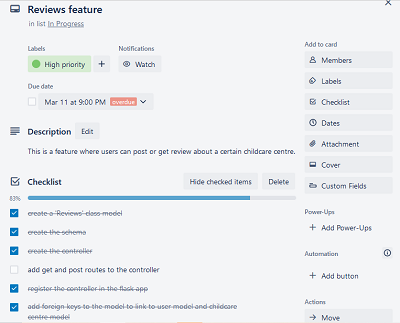

# T3A1 – Workbook
## By Nicole Hulett

### Q1: Standard source control process for a large project

Source control is the process of tracking and managing changes to software code. It helps to keep track of every modification to a project in a special kind of database. If mistakes are made, developers can easily look back at earlier versions of the code and fix mistakes while minimizing disruptions to all team members. 

Git is a popular and well know source control system (also called version control). Git is also a distributed source control system meaning that there is not just one place for the full copy of the source history. Every developer that has a working copy of the source code also has a repository that will contain the full history of all the changes or commits. Git has great functionality, performance, security and flexibility and these are all aspects that are vital for a large project with many developers working side by side. Git is also open source with plenty of community feedback and Git is great for large or commercial projects.

GitHub is a cloud hosting service for git repos. It is a location where the central repo can be stored, but still be accessed remotely from anywhere in the world. GitHub allows developers to share code with each other and coordinate together on a single project, small or large. Furthermore, GitHub is recommended for collaborative projects in real time. (Great Learning, n.d.) 

One of the biggest advantages of Git is its Feature Branch Workflow. When a developer is assigned or starts to work on a new feature or piece of code, no matter how big or how small, they create a new branch. This is basically an isolated environment for every change to the code, but keeps the main branch always in good quality, working condition. These branches are also great for organizational benefits and can represent different tasks in an agile environment. (Git Feature Branch Workflow, n.d.)

Pull requests are also vital for the source control process when working on a large project. A pull request is a way to ask another developer to merge one of your branches into their repository. This lets developers easily work together and discuss the work before integrating it with the rest of the codebase. 

#### Details of how to use Git in a large project:

```git clone``` is the command that will be first used to point to an existing repository (repo) and make a copy of that repo in a new directory at a different location. This then becomes the full working copy for that individual developer. All developers on the project can do this step. Cloning also automatically makes a remote connection called origin that points back to the original repo. In addition, developers of a large project could also just clone the particular branch they are after to work on with ```git clone –branch```. This saves on download time, instead of having to clone the main branch and then find the branch, it clones the branch directly. 

Alternatively, the developer may need to first create the new branch or switch to the specified branch with ```git checkout -b new-feature```. The ```-b``` tells git to create the branch if it doesn’t already exist. The checkout statement is used for developers to switch between branches. There should be a separate branch for each feature or issue of a large project.

The fundamental and collaborative Git workflow is composed of ```git add```, ```git commit``` and ```git push```. These three commands every developer needs to understand. They are the means to record source control versions of a project into the repo’s history. It is a continual process of edit/stage/commit for every developer on the project. First a developer will edit the files in the working directory, then the developer will stage the changes. Finally, when the developer is happy with the staged snapshot they will save the changes with a commit to the project history and push it to the remote repo so that other developers can see and work with the changes made.

```git add``` is a command that adds a change in the working directory to the staging area. It tells Git that you want to include updates in a particular file in the next commit but doesn’t actually yet change the repository by recording it. 

```git commit``` is the command that actually saves and records the changes to the repository. The ```git commit``` also often includes a message stating exactly the changes that were made or added in this commit.

Two other commands that are useful at this stage of development are; ```git status``` and ```git reset```. ```git status``` views the state of the working directory and staging area. ```git reset``` undoes a git commit or the staging area.

To push the feature branch up to the central/remote repository, the first command needed is ```git push -u origin new-feature```. The ```-u``` flag adds it as a remote tracking branch. After this initial command, just a ```git push``` is needed each time the developer needs to back it up to the central repo for other developers to collaborate on and view the commits.

```git pull``` is also a command that is used frequently, to fetch any changes to the main code base or branches on a remote or central server. This pull will update the developer’s local copy with the changes automatically. Alternatively, a ```git fetch``` can be done to fetch the details of any changes made upstream on a remote server, however, these changes will not be updated automatically into your working copy, the developer first gets a chance to review the changes before updating. 

The next stage of collaboration in working on a large project is a pull request. A pull request happens when a new feature is completed, and the developer wants to merge it to the main copy of the repo. First the developer ensures they have pushed the feature branch to the central server and then they file a pull request asking to merge their additions into main. Other developers will then receive this request and they will have the opportunity to review the changes before they become a part of the main code base. This code review is a discussion about the particular feature branch. A pull request can be done in the GitHub GUI and the specified team members can be notified automatically. Other team members are also able to pull the feature branch into their own local repository to work on and make commits, that continue to show up in the pull request for all to see. Once the pull request is accepted, the feature branch can then be merged with the main code base. 

The last step is to merge the new feature fully into the project. This is sometimes automatically completed by clicking an ‘accept’ button in the pull request GUI. Otherwise, the developer will need to switch to the main branch of the code within the local repo ```git checkout main```.  They will then need to ```git pull``` to fetch the content from the remote repo and update your local repo. The next command needed is ```git pull origin new-feature```. This fetches all the details and changes for the new feature branch. The final command needed for a merge is ```git merge new-feature```. `git merge` combines multiple sequences of commits into one unified history and basically it is used to combine two branches. It will join the new feature to the main, working code base. Another way to merge branches is with a `git rebase`. The rebase option creates a more linear history of commits for the project by copying the commits and then moving or combining the sequence of commits to a new base commit. It makes the commit history much cleaner.

Git and GitHub are vital for large projects with many developers. They are necessary tools that provide collaboration and organization for the project. This is just one way, using branches that large projects can be worked on and collaborated on successfully. 

### Q2 High Quality Software

There are many characteristics that ensure a high-quality software program. A good software is one that meets the need of its users, performs its intended functions reliably and is easy to maintain. (Software Engineering | Characteristics of good Software, 2023) The main characteristics of high-quality software are; functionality, usability, reliability, performance, security, maintainability, scalability and testability. According to (Buenaflor, 2017), the ISO /IEC 9126 standard identifies many of these same characteristics.  

Functionality in software designs refers to the ability of the software to meet the requirements and specifications that it was designed for. In addition, it should also behave as expected when used appropriately. Functionality determines the usefulness of the software for its purpose. Some examples of functionality in software are;
-	Data storage and retrieval
-	Data processing and manipulation
-	User interface and navigation features
-	Communication and networking
-	Security and access control
-	Reporting and visualization

Usability refers to the user having a positive experience when using the software. The software should be easy to use and understand for the end user. The amount of time required to learn how to use the software should be minimal. In addition, the attractiveness of the user interface of the program is also a factor of usability. 

Reliability means the software is free of defects and errors and performs consistently and accurately under a variety of different conditions and environments. To ensure reliability the software should have;
-	minimal bugs and errors in the code
-	a large number of tests for the code and functions
-	well-designed algorithms and data structures
-	adequate error handling and recovery
-	be compatible with other software or hardware.

Performance relates to the software running quickly and efficiently and its ability to handle large amounts of data or traffic to the application. Highly efficient software includes;
-	optimized and DRY coding principles
-	efficient use of memory and processing power
-	properly designed algorithms and data structures
-	appropriate processing or computation

Security is an essential characteristic of high-quality software. The software should be protected against unauthorized access and keep the data and functions safe from malicious attacks of any sort. Security in software relates to how data is collected and stored, including sensitive information. It also refers to who can be authenticated or authorized in a program and what different users have access to. 

Maintainability relates to how well the software can be understood and modified by other developers. It should be easy to change and update. Software systems often need to be able to extend their functionality, improve their performance or correct errors. In high-quality software, developers should effortlessly be able to understand the current code and software and make changes or updates easily in the future.

Scalability is important to ensure that the software can handle an increasing workload or can be easily extended to meet a growing need or large amount of traffic or users. Often software or projects start small but grow slowly or quickly as they become more well known. Software should be able to easily keep up with the growing traffic or data and furthermore the performance of the software should stay stable and not decline. 

Testability refers to software that is designed in a way that is easy to test and validate at all stages of development and production. Software should have a variety of different tests in place to test all aspects of the software or any changes or updates that may be made in the future. These may include unit tests, manual tests and more. 

Another standard that is also listed in the ISO/IEC 9126 standard is ‘Portability’. Portability is the ability of software to be transferred from one environment to another. This characteristic looks at adaptability, installation processes, coexistence and more. (Buenaflor, 2017)

### Q3 The MERN stack

The MERN stack is a collection of powerful technologies that are used to develop a full stack JavaScript web application that includes front end, back end and database components. It consists of four main components; MongoDB, Express, React and Node.JS. The MERN stack has a three-tier architecture system that consists of three layers. The Web is the front-end display tier, the Server is the application tier and the Database is the database-tier. 

MongoDB is a NoSQL (non-structured Query Language) database. This type of database is a non-relational database that does not require the data to be stored in fixed relational tables. A MongoDB database stores the data in a document orientated format that has very efficient storing and indexing techniques. (javaTpoint, n.d.) The data is stored in documents instead of tables. These documents then have a unique object id. The data in these document objects is then stored in fields such as key-value pairs instead of columns and rows. This makes the data much more flexible and easier to retrieve. This database uses JavaScript as the code language. In addition, MongoDB is schema-less meaning that one collection can hold many different types of documents and they don’t need to be related to one another.  The different documents in a collection can comprise a different number of values and fields. A MongoDB database uses indexing to retrieve the necessary data. Every data item has a particular primary or secondary index for easy retrieval. The benefits of a MongoDB database is that it is much faster than a relational database because the data is retrieved more simply than having to waste time in writing logical queries. MongoDB is also more scalable as it provides horizontal scalability and data can be distributed across multiple servers. MongoDB is also very simple to set up and use. 

Express is a backend JavaScript framework that is built on Node.js. It allows developers a platform to create a webserver or web APIs (Application Programming Interface). Express connects very easily with MongoDB databases and makes it easy to organize the application’s functionality with routing and middleware. Express allows the developer to define the routes of the application using HTTP methods and URLs. Also Express can send a request for data from a database and then receive a response from the database. Express is also able to send this response in the right data format back to React or the front end to be able to be rendered on the page. Express also has a very large suite of third-party add-ons to help provide developers with better functionality or security level. 

React is a front-end JavaScript User Interface (UI) library/framework, used for building web applications. It is used to build dynamic front-end user interfaces. It allows developers to create large web applications that can easily change the data of the page without having to reload it. React can assist developers to construct complex interfaces by using single components. It also allows these interfaces to connect to data available through the backend server. React is very easy to learn for beginners. It uses a component-based approach and uses plain and simple JavaScript. React helps to connect to data on the back end and render it as html. 

Node.JS is an open-source server runtime environment. Its main purpose is for executing JavaScript code outside the browser. Node.JS is not a framework or a programming language. It is often used for developing backend services using JavaScript code. Node.JS can run on all the main operating systems, such as Windows, Mac and more. Node.JS runs on the V8 engine developed by Google. All the operations in Node.JS are performed quickly like a network connection. Node.JS relies on different libraries and frameworks to provide additional functionality. For example, Express adds HTTP object functionality to the web application.

The MERN stack allows for a smooth development process of a web application. It also supports the MVC (Model View Controller) architecture that can separate the different areas of development within the application. The MERN stack covers all the web development stages. React is used to develop the front-end, Express and Node.JS are used to develop the back-end application and MongoDB is used to develop the database. (MERN Stack Explained, n.d.). The MERN stack is very simple and fast because it is only written in one language, JavaScript. It is also very easy for developers to switch between the client and server sides. 

### Q4 Knowledge and skills needed to develop a website for a small business.

There is much knowledge and skills needed to create and develop websites. IT workers must understand the architecture of a website or web application and understand how to communicate and work effectively with others. Skills and knowledge needed can be divided into different sections for the front end, back end, source control, communication, planning and more.

#### Front end:
Firstly, developers must have an understanding of the front end of an application. The front end refers to the user interface side of the website. To build the front end, developers must understand three different programming languages, HTML, CSS and JavaScript. 

HTML (Hypertext Markup Language) is the building blocks of a web page. It allows the content to be structured appropriately on the page. HTML consists of a series of elements which are used to wrap different parts of the content to make it appear in a certain way.

CSS (Cascading Style Sheet) is the basic language used to make sure websites are attractive and functional on different devices and screen sizes. CSS is needed to create the page layout, colours, fonts and much more. 

JavaScript is essential for web developers to understand for quality websites. JavaScript adds interactivity and different features to the web page. It is a programming language that enables developers to create dynamically updating content. JavaScript can be used on the client side and the server side of a website or application. JavaScript can assist with database interactions and back-end logic code as well.

### Source Control:
Another important skill for web developers developing a web project is understanding and using source control methods efficiently. Source control is used to track and revise code changes continuously throughout the development of the web site. A popular source control system is Git. Git can be used to save every little change made in a project and also to go back and review or change those changes. It is integral to developing a high-quality website. Developers also need to have knowledge in GitHub which is a Git repository cloud hosting service. It allows a team of developers to work together and share their work on a remote server. 

### Backend:
The second part of a web site is the backend. The backend is the area that the user never sees. The backend can connect the website to a database and a server and provide the code that controls the functionality of the website. There are many different languages that could be needed including Java, JavaScript, Ruby or Python. Python is a common and popular choice these days. 

A knowledge of the Python programming language or another similar one is imperative. Python is a computer programming language that is often used to build websites. It is a general-purpose language and can be used for many different project types. It is object orientated and includes high-level built-in data structures. Python is popular for it’s simple and easy to use syntax. Python also supports modules and packages being imported.

### Managing databases:
There are several skills required to be able to develop and manage a database for a website. A database is basically where information and data can be stored. There are two main types of database architectures to understand for developers; Relational (SQL) and Non-relational databases (No SQL). 

Relational databases are structured and data is organized in tables. The data within the tables will then have relationships with other tables. A non-relational database is a database that stores the information in a different way, often in key-value pairs or in documents or graphs. The project needs will determine which type of database is needed. However, skills in both types of databases is beneficial. 

PostgreSQL is an example of one type of database. PostgreSQL is compatible with several different programming languages which assist in making SQL commands to the database in the language of choice instead of plain SQL. PostgreSQL also helps with data integrity, security and reliability. PostgreSQL supports object relational database systems. 

MongoDB is a type of NoSQL database and is compatible with the JavaScript programming language. 

SQL (Structured Query Language) is a programming language used for storing and manipulating information in a relational database. This skill is responsible for the major commands of ‘SELECT’, ‘UPDATE’, ‘INSERT’ and ‘DELETE’ of a database. Knowledge of a relational database management system is also important. There are many database management systems, so developers need to ensure they are confident with at least one of them. 

ORM (Object Relational Mapper) is used to connect an application to a relational database in a simple way. It uses methods in the programming language of choice to query the database instead of having to use plain SQL queries. SQLAlchemy is a great ORM system to use for the Python language and a PostgreSQL database and there are many others as well. 

SEO (Search Engine Optimization) is another key skill. SEO helps a website to perform well in search results. Developers need to understand how to code pages efficiently so that they will load quickly and be more visible in search engines, write simple and easy to read URLS and use redirects correctly when site pages are changed or updated. (DeVry University, 2022)

#### Program frameworks 
An understanding of different frameworks is essential to make the development of websites more efficient. A framework in programming is a tool that provides ready-made components, structures, or code and that helps speed up the development process. Frameworks often provide generic functionality that can be selectively changed. Frameworks serve as a foundation to build a website on, so that you are not starting from scratch. (codecademy team, 2021) There are many different types of frameworks which all depend on the programming language being used. Express is an example of a backend framework that uses the JavaScript programming language. Flask is another backend framework that is used with the Python language. Knowledge of the right framework would be essential for the project. 

#### Testing and Debugging: 
This is an essential skill to ensure that a website functions flawlessly. There are a few different types of testing and debugging. Unit testing is commonly used for testing the functions of a program. Different programs can be used to help with the unit testing process, such as ‘Jest’ in the JavaScript language or 'Pytest' in the Python language. Another type of testing is manual testing. Developers need to come up with a range of different tests that test out each individual feature and then write down the expected results. They then need to test each function in a variety of different scenarios and see if the expected results were achieved or not each time and record these results. 

#### Security:
Security is another key skill to have when working on a website project. The developer needs to ensure that the project is safe from cyber-attacks and malicious data attacks. There are many different methods available. To protect sensitive information in databases, hashing is often used. Authentication and authorization are some other key areas that need to be addressed. There are different ways to go about it. One way is with the use of JSON web tokens. Further skills in this area or a similar area would be needed. 

#### Organisation:
A website project must have a reliable project management system in place. There are a few different project management systems. The Agile project management methodology is useful for working with many different developers. So, knowledge of ‘agile methodology’ is handy. Within this type of project management, programs called Trello or Jira can be used. These are work management tools that help to create a visual board of all the tasks need to be done for a project and to provide collaboration for developers. In Trello, you can break the project up into small task cards that provides a checklist of everything that needs to be completed for that task. The tasks can then be assigned a due date and placed in the correct column according to its current development status.

#### Planning skills
UX (user experience) design is an important skill needed in the planning process of creating a website. UX refers to creating and evaluating user journeys according to data and needs of the client and then producing designs to illustrate these user experiences. (DeVry University, 2022). It is the architecture of the website. These designs may be storyboards, wireframes or prototypes. Skills in other programs may also be needed in this process, such as the ability to use a program like Figma. Figma is a digital program to develop wireframes and other visuals. 

UI (user interface) design skills focus more on the visual and interactive elements of the website. It is more focused on the interior design of the website. Developers need to be able to gather and evaluate requirements and then design the user interface components like page navigation buttons and other similar features.

#### Other skills:
Problem solving: To develop a well-functioning website, problem solving skills are vital. Problem solving refers to the ability to identify a problem, developing possible solutions and then taking the appropriate course of action. This is often a skill used every day as a web developer. You need the skill to be able to use appropriate methods to confront unexpected challenges in an organized manner. 

Communication: Strong verbal, written and interpersonal communication skills are essential in working with a team and developing a website. When developing a website, developers need to be able to communicate effectively with each other, they also need to be able to communicate professionally with the client and all other stakeholders of the project. Communication is important every day when developing a project in a team.

Creativity: Creativity is the ability to think up ideas outside of the box and helps in planning, programming and problem solving. 

VS code: Knowledge of VS code, an IDE(Integrated Development Environment) is also crucial. This is where developers can write and develop their code. There are other similar IDE's, so it is a matter of personal choice and what features each IDE has. 

There are so many different skills needed to develop a website or application. 

### Q5 Knowledge and skills required to complete my own project

In Term 2, I developed a Childcare centre API project. A web service API (Application Programming Interface) is an application processing interface between a web server and a web browser. In particular, a RESTful API (Representational State Transfer) is when the client/browser sends requests to the server using functions such as ‘GET, PUT, DELETE, POST’ and the server than uses this input to start internal functions or make requests to a database and then returns output data back to the client. 

The REST API for my Childcare Centre project was developed so that parents could search and compare different childcare centres in their area and view other parents’ ratings and comments. The API would allow parents to search using a number of different filters including by; cost, suburb, parent rating, vacancies and more. The API was then able to send back specific childcare centre information. The API also allowed parents to create new childcare centre listings and create new comments and parent ratings for a listed childcare centre.

#### Knowledge and Skills needed for this project:

##### Research skills: 
I first needed to find and research a problem that needed solving. This search involved looking for current applications that were similar to this problem. The search covered social media sites, websites and applications that were all involved with different childcare centres. From this I was able to develop a need for a specific web application to not only list childcare centres, but to allow parents to see what other parents thought of the childcare service. 

##### Planning skills:
Knowledge of Entity Relationship Diagrams (ERD) was needed. I used a program called diagram.net to design the ERD for this project. To develop this API, I needed to create a relational database to store the data in. Before a database can be developed, a plan needs to be created. An ERD is basically a blueprint for the database. For an ERD, you must identify the different entities (tables) that you want tracked for the project and then list their specific attributes to collect data on. The ERD also identifies which entities needed to be related to each other. 

A project management tool was also essential to be able to use. For my project I utilized the service of Trello and a Trello board. I broke my project down into small tasks and then created a task card for each task with a checklist of things to be done for this task to be completed. These cards were then placed in a ‘To Do’ list. They could also be moved to the ‘In Progress’ or ‘Completed’ lists according to what stage they were up to. This is an essential tool when developing a project to ensure the project is organized and promotes collaboration when working with other developers. 

##### Development Skills:
VS code was the IDE (Integrated Development Environment) I used for this project. VS code is a code editor and a place to develop the code for the project. Skills in using VS code were essential.

The main framework used for this API was Flask. Flask is a lightweight WSGI web application framework that allows developers to easily develop web applications. This framework is written in Python and includes a collection of libraries and modules that allow an application to be built without having to worry about the low-level details of an application and other protocols. Knowledge of Flask was vital for the success of this process. 

The Python programming language was the main language used in this project. Knowledge and skills in the Python programming language were essential for this project. I needed to understand data structures, object-orientated programming, functions and the control flow of this language.  

The project used a PostgreSQL database. This is an object relational database management system that stores information in related tables with primary and foreign keys and other constraints.

The ability to use an ORM (Object Relational Mapper) was also needed for this project to connect the Object Orientated Program (OOP) with a relational database. The ORM simplifies the process of interacting with the database for the different CRUD (create, read, update, delete) operations. The ORM uses much simpler methods to query the database instead of using raw SQL commands. 

A knowledge of SQL is also required to better understand how a database can be queried. In this project, SQLAlchemy was the ORM used. SQLAlchemy uses function-based query construction that allows SQL queries to be built similar to Python functions and expressions. SQLAlchemy works great when querying a PostgreSQL database but can use raw SQL statements if needed. 

The Flask-Marshmallow package was also used in this application. Marshmallow is a library that helps with object serialization and deserialization. It helps to convert data types to native Python data types and vice versa. In the application I had to create schemas to assist this process. This process is needed when sending and receiving requests and responses from other components like the database. 

##### Security skills

Data security skills were also needed for this project to protect the data input and output of the database. I utilized Flask-JWT (Json Web Tokens) for this project. JSON web tokens can be used in a Flask application for protecting routes and providing authentication and authorization to users. There are many other methods for protecting data as well. I also used a library called Bcrypt to provide hashing for my sensitive information such as the user password. 

Git and GitHub
Skills were needed in Git and GitHub for this application. Git is a source control system and allowed my project to be constantly updated and saved. Each save (commit) could be accessed at any time for review or changes. GitHub is the cloud hosting service for remote Git repositories. I pushed my project to GitHub and this allowed me to share my project with my educators for assessment. 

##### Testing Skills:
Error handling skills are also needed to write quality code. In my project I had to understand different errors that may occur. I attached the appropriate error codes to certain statements. These error codes would then implement an appropriate statement explaining the type of error or I would manually state the error code to be returned. 

To test my API, I used a program called Insomnia. Insomnia is a tool to make dummy requests to the API and test out how it functions. You are also able to create cookies and manage authentication. Using this tool makes it simpler to test the development of the API in the development stage. 

Knowledge of the command line is essential in the development stage of this project. It is important to know the different commands that can be made to set up the application and required databases and then run the application. Knowledge of PSQL on the command line is also beneficial to confirm that databases have been created and seeded appropriately or deleted if need be. 

### Q6 Evaluate knowledge and skills used on project and improvements that could be made

As with any project, there are always improvements that can be made. My Childcare centre API was a very basic API web server with simple and expected endpoints. The project formed a solid foundation, that could easily be updated and scaled to a more complex API in the future. Below is an evaluation on my knowledge and skills used and future improvements that could be made. 

##### Researching skills
My research skills were adequate. I was able to use the common methods of using search engines and social media sites to research the area of interest and identify a common problem that needed a solution and would benefit many. To further extend my skills in this area I could have undertaken a survey or had discussions with current parents of young children to further understand their needs in relation to finding the right childcare centre for their children.

##### Planning skills: 
My ERD was quite basic with only 5 entities with simple relationships. I utilised diagrams.net confidently to design the ERD and it made my entities and relationships very clear. In the future, this ERD could become more extensive and complex. I could also improve by adding more constraints to each of my attributes. For example, a constraint of only being able to input an integer between 0 and 10 on the parent rating of the parent comments could have been added. 

```js
parent_rating = db.Column(db.Integer())
```
This is the actual code in the Flask application. It doesn't contain any constraints, but should contain a constraint, that only allows a rating(integer) between 0 and 10. 

The Trello board was effective in organizing the project and assisting me, as the developer, in developing it in an efficient and timely manner. The project was broken into seperate tasks according to a Flask application development needs. However, my Trello board task cards could have been broken down into smaller tasks and been more specific in the things needed to be done to complete the task. 



Here is a checklist of one of the tasks. This could easily again be broken down into multiple tasks for creating the schema, controller and more. Creating the controller is a big task, that could have been further broken down into different areas according to HTTP method. 

##### Development skills:
I utilized the Flask framework to effectively build a high quality and robust application. I effectively developed a solid and functioning API base. Further improvements I could make in this area is looking into the different libraries and packages that can be used in Flask and that would have further improved the quality or functionality of this project. 

My Python programming skills were adequate for the application. I used a number of different functions, classes, objects and control loops to get the desired outcome for different parts of the application. I could have enhanced the code and logic within the application. I would like to improve my use of functions in the Python programming language. 

```js
class User(db.Model):

    __tablename__ = "users"

    id = db.Column(db.Integer(), primary_key=True)
    username = db.Column(db.String(), nullable=False, unique=True)
    password = db.Column(db.String(), nullable=False)
    admin = db.Column(db.Boolean(), default=False)
    email = db.Column(db.String())

    childcare_centre = db.relationship('ChildcareCentre', backref='user', lazy=True)
    review = db.relationship('Review', backref='user', cascade="all, delete-orphan", lazy=True)
```
This is an example of a class I used to create a table in the database. There is also relationships to the childcare centre and review entities. This code is very neat, tidy and easy to read.


My understanding of PostgreSQL provided the API with a solid database structure for my project. The database was structured in logical tables and used appropriate primary and foreign keys. In the future, I could add more constraints to each of the attributes within a table to provide better data integrity in the database. 

Through my use of SQLAlchemy, I was able to make numerous different queries to the database for each of the CRUD operations. I also effectively used a range of different filters to find and return information according to certain data details. To improve this skill, I need to be able to develop more complex queries across the different entities and then create a custom response instead of just using the stated schema developed through Marshmallow. 

```js
@childcare_centre.get('/small_centres')
def get_small_centres():
    small_centres = ChildcareCentre.query\
    .filter(ChildcareCentre.maximum_capacity <= 50)\
    .order_by(ChildcareCentre.maximum_capacity)\
    .all()

    if not small_centres:
        return {"message" : "No childcare centres listed with a capacity under 50"}, 404

    return childcare_centres_schema.dump(small_centres)
```
This code is an example of a query to the database that filters the response and then orders the results. This code just returns an already created schema. A custom response would be an improvement in this area. 

I was able to effectively use Flask-Marshmallow package to create schema for each of the entites in the API. These schemas were then used to return data in the required form for the correct request. I could improve this skill by ensuring that the schemas only displayed information that was needed, and no duplicate data was provided in the response schema. 


##### Testing skills
I used Insomnia regularly throughout the development of the project. It was very effective in testing my routes in a safe and secure location and giving accurate results. To improve this skill in the future, I would like to research and further practice using this tool and find out what more is on offer within the service. I used only the basic functions of the tool. 

##### Security skills
I was able to successfully use Bcrypt to hash my passwords on input into my API. I also effectively created functions in my API to create JSON web tokens for new users and to authenticate already registered users with their web tokens. I used the statement ```@JWT required``` on certain routes within my application to ensure that only authorized users were able to access or change that data. To improve this skill, I would like to further understand how the JSON web tokens work and other ways I could utilize the web tokens in my application. 

```js
@childcare_centre.post("/")
@jwt_required()
def create_childcare_centre():
    childcare_centre_fields = childcare_centre_schema.load(request.json)

    name = ChildcareCentre.query.filter_by(name=childcare_centre_fields["name"]).first()

    if name:
        # return an abort message to inform the user that a childcare listing already exists for this childcare
        return abort(400, description="Childcare centre already exists")

    try: 
        childcare_centre = ChildcareCentre(**childcare_centre_fields)
            
        db.session.add(childcare_centre)
        db.session.commit()

    except:
        return { "message" : "Your information is incorrect"}, 400

    return childcare_centre_schema.dump(childcare_centre)
```
In the second line of this code, the `@jwt_required()` object is used. It is used on the post route, so that only users logged in can post. This code also includes error handling with try/catch code blocks and the appropriate error codes. 

Web development is a dynamic skill that is forever changing. The key for all developers is to never stop learning and always reflect on ways to do better or improve for the future. 

### Q7: Control flow in JavaScript

Control flow in coding is how your computer runs the code from top to bottom. It starts from the first line of code and ends at the last line of code. However, the computer may come across statements that changes this control flow of the program, such as loops, conditionals or functions. These statements also include logical or comparison operators. These operators are symbols that are placed between two expression and will evaluate to either `true` or `false`. For example; ```(age < 15) ```, this will return `true`.

Loops are iteration statements that will keep running until there is nothing left to loop over or the condition becomes false. There are many types of loops in JavaScript. One type of loop is the `for` loop. The `for` loop is a conditional loop that runs based on if a certain condition is true. As long as it is true, the code will keep executing. The basic ‘for’ loop will contain a variable decaration for the index of the array it is iterating over or similar. Next, there is a condition that needs to be checked and then the last part is an increment or similar of the original variable. These three parts are optional in a loop though. 

```js 
for (let i = 0; i < arr.length; i++){console.log(arr[i])}
``` 
This loop will continue until the condition `i < arr.length` becomes false. 

There are two other `for` loops that can also be used. The `for…in` statement iterates a specific variable over all the properties of an object. For each distinct property, JavaScript will execute the specified statement.

```js 
for (const i in arr){
    console.log(i);
}
```
This will return a list of indexes for each item in the array or for an object it will return the list of keys. 

The `for…of` statement creates a loop iterating over iterable objects such as arrays and objects. Statements can then be executed for the value of each distinct property. This loop is focused more on the values. 
```js
for (const i of arr) {
console.log(i)
}
```
This code will simply log each item in the array or for an object will log each value. 

The next type of loop is a `while` loop. It continues to run while a condition is true. A ‘while’ loop is used when you are unsure about how many times the loop should run. 
```js
while (arr.length < 10) {
console.log(arr)
}
```
This loop will continue to run until the length of `arr` becomes 10 or more.

Another similar loop is the `Do-while` loop. This loop ensures that at least one bit of code is executed first and then the while loop runs and checks the condition. This is useful for when you want to loop through an element at least once. 

```js
do {
console.log(“hello”)
i++;
} while (i < 3);
 ```
This code will always log `hello` first, it will then increment the i variable, then it will check to see if the condition is still true. If it is still `true`, then it will re-run again by logging `hello` and incrementing. 

Conditional statements are used when you need to perform different actions based on different conditions. The conditional statements in JavaScript are ‘if, else if and else’ and ‘switch’ statements.
The ‘if’ statement is used when we want a block of code to be run as long as the condition is true. ‘else if’ can be added to this code block if you want to be able to check different conditions. The ‘else if’ code will only be run if the condition before it is false. To set a default value to an ‘if’ statement you put the ‘else’ statement on the end and this will run if everything before it is false. 

```js
if (score < 10) {
console.log(“Keep trying!”)
} else if (score = 10) {
console.log(“Great work!”)
} else {
console.log(“Fantastic you went way beyond”)
}
```
This code will console log a message depending on what the current score is. If the score is less than 10, it will log `Keep trying!`. If the score is exactly 10, it will log `Great Work`. Then if the score is any other number, then it will log the last console log message. 

The second type of conditional statement is a ‘switch’ statement. The ‘switch’ statement first takes in an expression and evaluates it once. It then checks it against the following cases. If any of the following cases match the expression then the return statement within that case will be executed. It is best to use ‘switch’ statements when you are testing just one value and to use ‘if, else if, else’ statements when you need to test multiple conditions. 
```js
switch (num) {
Case 1:
Return “apple”;
Case 2:
Return “banana”;
Case 3:
Return “pear”;
Case 4:
Return “watermelon”; 
}
```
This code will take in the `num` value and then check to see if it matches any of the cases (1, 2, 3 or 4). If it does match one of those cases, then it will return that cases stated value. 

Functions also affect the control flow of a program. Functions are blocks of code that can be called by other code, by itself or by a variable that refers to the function object. Usually when you call a function, it takes in one or more arguments and then can optionally return a value. Functions will only run when they are called. They may be declared early in a program, however, that does not mean they will run then. When a function is called, it is similar to pausing the program and going to find the function to run it and then it goes back to where it was before and continues. 

Some other basic statements that affect control flow are the ```return```, ```continue``` and `break` statements. The ‘return’ statement is used to return from a function back to the main code. The program execution will resume at the statement following the point at which the function was called or it will exit the code if it is in the main program block. The `break` statement is used to terminate a loop or switch statement. The `continue` statement is used to restart a `while`, `do-while` or `for` statement. It terminates the current iteration of the innermost loop and then continues iteration of the loop with the next iteration. It does not terminate the loop entirely. 

```js
function add(num1, num2) {
  result = num1 + num2
  return
}
```
This return statement, will break out of the function and return to the code block where it was before calling the function. Nothing will be returned to the main program.

Control flow is affected when the computer has to pause everything until conditions are met and everything possible is executed. 

### Q8 Type Coercion in JavaScript

Type coercion is the process of automatic or implicit conversion of values from one data type to another. Implicit coercion is when JavaScript automatically converts one data type to another. The conversion happens in the backend and is unseen. On the other hand, explicit conversion is when the developer intentionally converts between different types by writing the appropriate code using conversion functions such as ```String()```, ```Boolean()``` and ```Number()```. 

JavaScript has one operator that does not trigger implicit type coercion and that is the strict equality operator (`===`). This operator will never implicitly convert the data types. On the other hand, the loose equality operator (`==`) does both comparison and type coercion if needed. For example: `5 == ‘5’` will return `true`. JavaScript will automatically convert string 5 to the numeric value without the developer having to do anything. 

There are three types of coercion that can be applied in JavaScript. Primitive values in JavaScript are string, number, bigint, boolean, undefined, symbol and null. These values can only be coerced into a string, boolean or numeric value.  They can not be implicitly coerced into an object. 

Implicit coercion can also apply to objects. First JavaScript would convert an object to a primitive value, next it would then be converted to the final data type of string, boolean or number. For example, JavaScript automatically converts an array to a comma separated string when a primitive value is expected. This is often the case when a developer tries to output an array. 

Some examples of type coercion:
```js
“This is a string message from” + 2019
``` 
When the binary operand ```+``` is used with a string operand, then implicit coercion will occur and other data types will be coerced to a string value. The number 2019 will be coerced into a string value. 

Implicit coercions for Numbers occur in many cases including for comparison operators, bitwise operators, arithmetic operators and the loose equality operator. 
```let result = 10 - "5"```
JavaScript will implicitly coerce the `"5"` from a string into a number. For arithmetic operators, the only time this doesnt' work is when the `+` is used. Instead, numbers will be coerced into strings.
```let result = 5 + "4"```
The value of result will be 54 as 5 is coerced into a string. 

For implicit conversion of Boolean values, logical operators are often needed, such as `||` (the or operator - will return the first value) and `&&`(the and operator - will return the last value in this expression) or `!`(the not operator).
`"5" && 9`
If this expression was deciding if both these numbers were odd numbers. It would return the second number in the expression. 

### Q9 Data Types

JavaScript has many different data types and these are categorized into primitive and non-primitive data types. Primitive data types are the most basic data type and they are immutable, which means they cannot be changed. Non-primitive data types are slightly more complex and are mutable, meaning they can be changed. There are seven primitive data types in JavaScript and these are; String, Number, BigInt, Boolean, Symbol, Null and Undefined. (JavaScript data types and data structures, n.d.) The main non-primitive data type is Objects. 

String is a data type that represents textual data. Strings can be enclosed in single quotes, double quotes or backticks.

```js
let x = "Hello to the project"
```
Single and double quotes are pretty much the same. However, backticks provide more functionality and allow an expression or value to be embedded in the string by also wrapping it with `${}`. Backticks also allow a String to span multiple lines. Strings are immutable and it is impossible to change a character. The different characters in strings can be accessed by a position, starting from the 0 index and using square brackets or the method `.at()`. The `.at()` method allows negative indexes. Other methods for Strings are ```.toLowerCase()``` or ```toUpperCase()``` and much more. Strings also have a ```length``` property to determine the length of a String. 

Number is a data type that incorporates all types of numbers, including positive and negative floating point numbers and positive and negative integers up to a certain range. There is a special type of number value ```NaN``` which stands for ‘Not a number’ that is used when the result of an operation can not be expressed as a number. It is an invalid number. In JavaScript you can make Numbers more readable by adding underscore seperators in the code. JavaScript will remove these underscores when executing the code. 
Here is an example of using Numbers: 
```js
let result = 5 + 3
```

BigInt is a numeric type of data that refers to integers of arbitrary length. Basically, a BigInt is a very large integer with more accurate precision. A BigInt is created by adding an ```n``` to the end of the integer or by calling the ```BigInt()``` function. BigInt numbers can not be mixed with regular numbers, a conversion needs to happen first. However, BigInt and regular numbers can be compared.
```js
let answer = 5n + 3n
```
Boolean is another primitive data type that is categorized by only two values; ```true``` and ```false```. This data type is a logical entity type and these values are used for conditional operations, including ternary operators, if..else and while loops.

Null is a data type that has exactly one value. This value is ```null```.

Undefined is a type that again has exactly one value and that is ```undefined```. This data type indicates an absence of a value. This can sometimes happen when a variable has been declared, but not initialized or a return statement has no value to return, JavaScript will implicitly return ```undefined```.

Symbol is the newest and final primitive value in JavaScript. Symbols are unique values that are used in objects. They are used as a special key in key-value pairs. The purpose of Symbols is to create unique property keys that will not clash with keys from other code. A new Symbol can be created with the `Symbol()` constructor.
```const age = Symbol(“age”)```

Objects are non-primitive data types that are mutable and can be changed and added to. An Object is a memory value that is referenced by an identifier. 

An Object Literal (similar to a Python Dictionary) is wrapped in curly braces and includes key-value pairs or properties. These key-value pairs have property names and values.
```js
let child = {
“name”: “Saskia”,
“age”: 6
}; 
```

This child object has two properties ```name``` and ```age``` and each property is assigned a value ```Saskia``` and ```6``` respectively. 

Dot notation or bracket notation can be used to add, change or remove properties or values from an object. 
```js 
child.height = “120cm”
``` 
```js
child[“height”] = “120cm”
```
Arrays are also special types of Javascript Objects. Arrays are an indexed collection of values. Arrays are created with square brackets and commas separating the elements. The first element has an index of 0 and second element has an index of 1 and so on. JavaScript does not support negative indexes to read an element in an array. There are many methods used to add, change or delete elements in an array. 

A third type of Object is a Function. Functions are pieces of code that are used repeatedly throughout a program. A Function must be called to be able to execute its code. Functions are also able to return code or values. Functions are first-class Objects because they can be passed to other functions, returned from functions, assigned to variables and properties, they can be called and they can also have properties and methods just like other Objects. 

```js 
function add(a, b) {
result = a + b
return result
}
```
Sets are also an example of another built in data Object. A Set Object stores a unique collection of values of any type. A value in the Set must only occur once, making it unique in the Set. Developers can iterate through elements in a set in insertion order. This order corresponds to the order in which each element was inserted into the Set. New Sets can be created with the ```Set()``` constructor. 

```js 
const set = Set(5, “text”, “hello”)
```
This was a basic overview of the different data types and structures within the JavaScript programming language. 

### Q10 Manipulating Arrays

In JavaScript, an array is used to store different data types in one object variable. Elements in the array can be accessed later by that variable name and an index. An array is declared with square brackets. 

```js
let array = [ ];
```
Arrays can be manipulated by using many different methods. Methods are basically actions that developers can use on arrays to add, remove, modify and much more. Following, are some different methods that can be used on arrays.

Arrays can be converted to strings in two different ways. The method ```toString()``` can be called and this converts the array to a string with commas separating each value. The ```join()``` method joins all the array elements into a string. It is very similar to the ```toString()``` method, however, you can also specify the separator, it doesn’t have to be a comma. 

There are easy ways to remove and add new elements in an array. To remove an element from an array, the ```pop( )``` method is used. It removes the last element from an array and then returns it. The ```push( )``` method adds a new element to the end of an array. This method also then returns the new array length. 

```js
const colours = ["red", "orange", "blue", "green"]
colours.push("pink")
// This will add pink to the end of the array and then return the length of the array which is 5.
```

Shifting elements refers to the first element of an array. The ```shift( )``` method removes the first element and the other elements are all ‘shifted’ to a lower index. This method returns the element that was shifted out. The ```unshift( )``` method adds a new element to an array at the beginning and moves the older elements higher on the index. This method returns the length of the array. 

```js
const colours = ["red", "orange", "blue", "green"]
colours.shift()
// This code will remove red from the array. It will also return the element red. 
```

Array elements are accessed using their index number. An array index starts at 0 for the first item in the array and then goes to 1 for the second item and so on. Indexes are stated in square brackets. 

```js
const colours = ["red", "orange", "blue", "green"]
console.log(colours[2])
// This will console log blue to the console as it is the element at index 2
```

The ```length``` property is useful for appending a new element to an array. 

```js
let animals = [“dog”, “cat”, “horse”]; 
animals[animals.length] = “bird”;
```
The `animals.length` expression would be 3 in this instance, as there are three elements in the array. Therefore, `animals[3]` would append a new element onto the end of the array, as there is no index `3` yet. 

Arrays are also able to be concatenated or merged. The ```concat( )``` method creates a new array by merging (concatenating) two existing arrays. This method does not change the existing arrays, it always returns a new array. This method can also take strings as arguments. 

```js
let array1 = ['a', 'b', 'c']
let array2 = ['d', 'e', 'f']
let array3 = array1.concat(array2)
// The expected output for array3 will be ['a', 'b', 'c', 'd', 'e', 'f']
```

The ```splice ( )``` method changes an array by adding, removing and inserting elements. The first parameter in this method is the starting point for adding or removing elements in the array. The next parameter defines how many elements should be removed from that index. Any other parameters define the new elements to be added. This method then returns an array with any deleted items and removes them from the original array. If the second parameter is not declared, every element from the given starting index will be removed from the array. To just add items, you need to set the delete parameter to ‘0’. 

```js
fruits = ['apple', 'banana', 'orange']
fruits.splice(2, 0, “lemon”)
// This method will add lemon at index 2 and this will then push the orange to index 3. No items will be deleted
```

The ```slice( )``` method slices out a piece of an array into a new array. It does not remove any elements from the original array, it just creates the new one. This method takes two arguments only. The first argument defines the starting element and the second argument defines where the slice should go up to, but not including that element. If the end argument is not stated, then this method will slice out the rest of the array. The best way to use this method is to assign it to a new variable. 

```js
let fruits = ['apple', 'banana', 'orange', 'lemon']
let fruitSlice = fruits.slice(1, 3)
// The fruitSlice variable will contain a new array that contains the elements banana and orange as they were in index positions 1 and 2.
```

The ```indexOf( )``` method looks for an item in an array and returns the index of where that item was found. If it is not found, than it returns ```-1```. A similar method, ```lastIndexOf( )```works the same, but looks for the item from right to left instead. So it returns the last index of where the item was found.

The next three methods are quite similar in functionality. ```filter ( )``` is a method that creates a new array of items that pass a certain condition that is provided by a function. This method does not change the original array. This method is useful when you want to select a subset of multiple elements from an array. 

```js
let fruits = ['apple', 'banana', 'orange', 'lemon']
let newArray = fruits.filter(fruit => fruit.length <= 5)
// New array will output apple and lemon as they both have 5 characters
```

Furthermore, the ```map ( )``` method  creates a new array of the same size by calling a function on each element of the array and returning this new array. This is good to use when you want to transform an array. 

```js
const numbers = [1, 2, 3, 4]
const map1 = numbers.map(x => x * 2)
console.log(map1)
// map1 will output a new array with each item for numbers multiplied by 2. The new array will be [2, 4, 6, 8]
```

The ```forEach ( )``` method is used to iterate through an array. It can apply a function on all items in an array. It is similar to using a for loop.

```js
colours = ["red", "blue", "green"]
colours.forEach((item) => console.log(item));
// This console logs each item in the array. Instead of a console.log, other types of processes could also occur for each item of the array.
```
The ```every( )``` method checks if all items in an array passes a specified condition and returns true if passed, otherwise returns false. The ```some( )``` method is similar, but only one or more items needs to pass to return true. Similarly, the ```includes( )``` method checks an array for a specified item. If the item is not found, it returns false. 

The ```find( )``` method returns the value of the first element that passes a certain test. This method executes a function for each array element. 

```js
const numbers = [1, 2, 3, 4, 5, 6, 20, 8]
const find = numbers.find(element => element > 5)
console.log(find)
// The expected output will be 6, as it is the first element that is greater than 5
```

Arrays can also be sorted in different ways. The ```sort( )``` method sorts an array alphabetically. The ```reverse ( )``` method reverses the elements in an array. It can also be used to sort an array in descending order. To do a numeric sort, you can use the ```sort ( )``` method, but you also need to provide a compare function. 

```js
let points = [5, 10, 1, 2, 11]
let pointsSorted = points.sort(function(a,b){return a-b});
console.log(pointsSorted)
// This code will sort the points array into numerical order
``` 
The compare function should return a negative, a zero or a positive number depending on the values inserted. If the result is negative, the sort function will sort ‘a’ before ‘b’ and if the result is positive, b will be sorted before a. However, if the compare function returns 0, no changes will be done with the sort order. After an array is sorted, you are then able to find the lowest or highest number of an array by getting the first or last index and displaying their values. 

### Q11 Manipulation of Objects in JavaScript
An Object is a collection of properties. A Property is a “key-value” pair, where the key is a string or symbol that is case sensitive and is called the property name and the value can be any data type. An Object is defined by curly braces and then a list of properties. 

There are different ways to create an Object. The first, very simple way is to declare a variable and then with curly braces, assign properties in key-value pairs. 

```js
const animal = {
  name : "Gypsy",
  type : "dog",
  age : 2
}
// This is an example of creating a single object
```
The second way is to define the Object by creating a constructor function, then create an instance of the Object with the ```new``` key word. The property values are passed to the constructor using arguments. The constructor function creates a blueprint of the object and is great for reusability. Another way to create an object is with the ```Object.create( )``` method. This method allows you to choose the prototype object for the object you want to create, without having to define a constructor function. You simply pass in the object protype as an argument to the ```Object.create( )``` method. Another way is to create a function with parameters and then create new instances of the object with the new keyword.

```js
function Animal (type, habitat) {
    this.type = type
    this.habitat = habitat
}

dog = Animal("mammal", "outside")
// This creates a new instance of the Animal object called dog. 
```

To access Object properties, you can use bracket notation or dot notation. Bracket notation is when you provide the key in square braces. ```object[key]```. Dot notation is when the key is listed after the object name, separated by a dot. ```object.key```

```js
const animal = {
  name : "Gypsy",
  type : "dog",
  age : 2
}

console.log(animal.name)
// This will return the value 'Gypsy'
console.log(animal[name])
// This will also return the value 'Gypsy'
```

To get all the listed values of an Object you can use the ```values( )``` in-built method. This method returns an array of all the values (without the associated key). On the other hand, to get a list of all the keys, the ```keys( )``` method is used. This method requires a new array to be created and a variable for it to be stored in. To iterate over object properties a ```for…in``` loop can be used. 

```js
Object.values(animals)
// This code using the animal object from above will return an array with elements "Gypsy", "dog" and 2. 
```

To add data to an object, you can use either dot or bracket notation. ```object.items = 10``` This adds a new property with items as the property key and ‘10’ as the property value. Or it can be done like this ```object[‘type’] = ‘student’```. 

If a value needs to be changed, again the dot or bracket notation is used. ```object.name = “Nicole”```. To delete a property, the `delete` key word is needed before the property value. ```delete object.name```.

The ```Object.freeze( )``` method freezes an Object. A frozen object cannot be changed. No new properties can be added or any properties removed. It also prevents any of the values of the properties being changed. To check if an object is frozen, you can you the ```Object.isFrozen( )``` method, which will return either true or false for that object. 

Another similar method is the ```Object.seal( )``` method. This method prevents you from adding or deleting properties of an existing object. However, this method allows changes to be made to existing property values. 

There are two ways that objects can be merged. The first method requires the spread syntax to be used. A new object is created in this method. 
```js
let list = […students, …teachers]
// The new list object will contain all the properties from both the students and teachers objects
```

The ```Object.assign( )``` method copies the properties of the needed objects to a target object and then returns the modified target object. In either of these methods, if there are the same two properties in different objects, then the property from the most right object rewrites any others that come before it.  

```js
const team1 = {a : 50, b : 10}
const team2 = {c: 4, d : 100}
const newTeam = Object.assign(team1, team2)
console.log(newTeam)
// Object { a: 50, b: 10, c: 4, d: 100 } is the expected output
```

In JavaScript you can define properties for all objects created by a certain constructor using a prototype property. This will define a property that will be inherited or shared by all objects of the specified type, rather than just the instance of the object. ```Car.prototype.color = “red”;``` All objects through the ‘Car’ constructor will now have a color property with a value of red. 

Objects are also able to have methods as properties. A method is basically a function of an object. Methods are assigned just like normal functions, but as a property of the object. Methods are normally defined on the prototype object, so that all the instances of that object can use it. 
```js
objectName.methodName = functionName;
``` 
The objectName is an existing object, methodName is the name you give the method and functionName is the name of the function. Once a new method has been created, you can then call the method on the object, using just the method name and stating any parameters. `objectName.methodName(params)`

JavaScript also has a special keyword `this` that is used with methods. This keyword can be used with a method to help refer to the current object. Therefore, a method can be used on more than one object without getting confused. `this` points to the property values of the specific object and is a hidden value in a function call. 

Getters and Setters can also be used with objects. A getter is a function that is associated with a particular property and gets the value for that property. A setter is again a function that is associated with a property that sets the value of a specific property. Getters and setters can be defined when the object is created or they can be added later to an existing object. Getters and setters are defined like regular methods but are prefixed with the word ```get``` or ```set```. The ```get``` method should have no parameters, whereas the ```set``` method should have exactly one parameter, which is the new value to be set. Getters and setters can also be added to an object at any time after creation using the ```Object.defineProperties( )``` method. This method uses parameters. The first parameter is the object name on which you want to add the getter or setter. The second parameter is in the form of an object where the property name is the name of the getter or setter and the property value is another object for defining the getter or setter functions. 

```js
const adult = {
  firstName : "Nicole",
  lastName : "Hulett",
  get fullName(){
    return this.firstName + " " + this.lastName;
  }
}
console.log(adult.fullName)
// the getter gets the values from firstName and lastName and creates a string out of them and the new property 'fullName' can be called on the adult object. 
```

### Q12 Manipulating JSON in JavaScript

JSON stands for JavaScript Object Notation and uses very similar code to creating objects in JavaScript. JSON is helpful for sending data between the client and server and vice versa. When receiving data from a web server, the data is always a JSON string. JSON is also language independent, so it is not just unique to JavaScript, other programming languages are also able to use it. The JSON format is text-only, which is what makes it easy to send between computers. JSON data is often stored in a ```.json``` file, or if it’s within JavaScript as an object or a string. 

Data in JSON format is stored within curly braces in key-value pairs. In JSON, keys must be strings, written with double quotes, unlike JavaScript objects, where the property key does not need surrounding quotations. This is then followed by a colon and then a value. Values in JSON must be a string, number, object, array, boolean or null. 

JavaScript has two inbuilt functions for converting between JSON strings and JavaScript objects. The ```JSON.parse( )``` function converts JSON strings into JavaScript objects. You are then able to manipulate the stored data like any JavaScript object. 

On the other hand, the ```JSON.stringify( )``` function converts a JavaScript object into a JSON string. This makes sending the data to a web server much quicker and simpler. You can also use these functions to turn an array into a JSON string or vice versa.

```js
const text = {
  name : "Nicole",
  lastName : "Hulett",
  age : 34
}

const str = JSON.stringify(text)
console.log(str)
// str is now a JSON string. 
```

You can manipulate JSON data by first converting it into an object with the `JSON.parse()` function. Then you can access the object like you would any normal JavaScript object. 

```js
let child = '{"name" : "Saskia", "age" : 6}'
const obj = JSON.parse(child)
obj.name = "Tully"
console.log(obj[name])
// This piece of code creates a JSON string. It then uses the parse function to turn it into an object. The object then uses the key to rename the value. It then console logs the new value. 
```

Date objects are not allowed in JSON. If you need to include a date, you should write it as a string and then convert it back into the date object later. Functions are also not allowed in JSON. Again, if you need to include a function, write it as a string and then turn it back into a function at a later time. 

You can store JSON data in local storage with ```localStorage.setItem(“name”, JSON data name)```. 

You are then also able to retrieve the data with ```localStorage.getItem(“name”)```. Then you would need the parse function to turn it into a JavaScript object. 

### Q13 Commenting Code
### Q12 Comments are above each referenced line of code

```js
// This first line creates a blueprint object named Car
class Car {
  // The constructor method on this 'Car' class is used for creating and initialising an object instance of that class. In this instance it provides a custom initialization with the 'brand' argument. 
  constructor(brand) {
    // This next line creates the instance properties. The 'this' keyword here refers to the object. The property here will have a key of car name and the value will be a brand.
    this.carname = brand;
  }
  // 'Present' is a method that is defined on the prototype of each class instance. When created, each class instance will have access to this method.
  present() {
    // This method returns a string "I have a (some brand of car)". In place of the (some brand of car) will be the value for the carname property.
    return 'I have a ' + this.carname;
  }
}
// The 'extends' keyword here is used to create a 'Model' class of another constructor, in this case the 'Car' class. The class model will inherit form the Car class.
class Model extends Car {
  // This constructor method provides an additional custom argument for creating and initialising an instance and that is the 'mod' argument. The brand argument will also be needed when creating a new object instance. 
  constructor(brand, mod) {
    // The 'super' keyword here is used to access/lookup the 'brand' property of the Car class. Super must be used before using the keyword this
    super(brand);
    // This creates another instance property for the 'Model' class. The property here has a key of model and the value will be stored in mod.
    this.model = mod;
  }
  // Below is a method named 'show' that is attached to the 'Model' class and object instances of this class will have access to this method.
  show() {
    // This method, when called, returns a string. First it uses the 'present' method on the current object and gets a return result of a string which it places in the first part of this string, it adds on "it was made in" and then it also adds to the string the value (mod) from the model property in the Model class. The returned string should be something like "I have a Toyota, it was made in 2022"
    return this.present() + ', it was made in ' + this.model;
  }
}
// This is an array of makes of cars that is stored in a 'let' variable named makes. A let variable is block scoped and is able to be updated but not redeclared. 
let makes = ["Ford", "Holden", "Toyota"]
// The next line creates a new array of years stored in the models variable. The `Array.from()' method creates a new, copied array instance from an iterable or array like object. The Array.from() method has one required argument, the object to convert into the array and then two optional parameters. Within this method, the first paramater, the object is in the form of another function `new Array()`. This function just creates the new array object with a given number of elements. '40' is the argument passed to this new Array function. So the new array that will be created will have a size of 40 elements and this is the first parameter in the Array.from method. The second parameter in this method is in the form of an anonymous fat arrow  map function '(x, i) => i + 1989'. The x is undefined. The 'i' argument begins at 0 and then increments by 1 for each index in the given array. This maps over each element in the array object created in the Array.from method. The array finally created is an array of years from 1980 to 2019. 
let models = Array.from(new Array(40), (x,i) => i + 1980)
// This randomIntFromInterval function returns one random integer number, however the number returned must be between 2 numbers, a range, a min and max (inclusive) that is given as arguments of this function. 
function randomIntFromInterval(min,max) { // min and max included
// It returns one number. First it uses the Math.random() function to get a number. It also uses the min and max arguments passed in to the function to get another number, so the min number is taken away from the max number and 1 is added. This number and the random number got before are multiplied together. Then the min number is added to that multiplied number. The last step is the Math.floor function is used to round down the number and return the largest integer less than or equal to the given number. 
    return Math.floor(Math.random()*(max-min+1)+min);
}
// This is a for...of loop that iterates through each element in the models array.
for (model of models) {
  // The next line finds a value for the variable make. First it calles the randomIntFromInterval function. It passes in 0 as the first argument (the min parameter) and it works out the value of the second argument, which is the length of the 'makes' array minus one. This becomes the second argument (max parameter) for the randomIntFromInterval function.  The function then runs and returns an integer number. This number is then the index number for the makes array which is stored in the make variable. eg. make = makes[7] (This will access the element at index 7 (6th element) in the makes array)
  make = makes[randomIntFromInterval(0,makes.length-1)]
  // This process is repeated for the model variable to get the models index number. However, the max argument that is passed into the randomIntFromInterval function still gets the max number argument from the length of the 'makes' array minus 1 (not from the models array). The function again returns an integer number and this number is the index number of an element in the models array that is stored in the model variable. eg. model = models[9], this will get the element at index 9 in the models array.
  model = models[randomIntFromInterval(0,makes.length-1)]
  // This next line creates a new object instance named 'mycar' from the 'Model' class blueprint, which inherits from the 'Car' class. Two arguments need to be passed in to initialise this instance; make and model values. 
  mycar = new Model(make, model);
  // At the end of the current iteration of the for loop of 'models', it will log to the console a string. First though the new instance of the object, 'mycar' will call the 'show()' method. This method will then also then call the 'present' method to get a returned string for the brand name of the car. Once returned the 'show' method will create a new string with the returned string and the model property value (year made). The returned string will be like "I have a Toyota, it was made in 1980".
  console.log(mycar.show())
}
// As there are no break, return or continue statements in this for loop. The loop will continue to run for all elements of the models array. 
```

### References
Buenaflor, L. (2017, September 02). ISO 9126 Software Quality Characteristics. Retrieved from Medium: https://medium.com/@leanardbuenaflor/iso-9126-software-quality-characteristics-a25a26e7d046

codecademy team. (2021, 09 23). What Is a Framework? Retrieved from codecademy: https://www.codecademy.com/resources/blog/what-is-a-framework/

DeVry University. (2022, December 08). 13 Web Developer Skills You Should Have. Retrieved from DeVry University: https://www.devry.edu/blog/13-web-developer-skills-you-should-have.html

Git Feature Branch Workflow. (n.d.). Retrieved from Atlassian: https://www.atlassian.com/git/tutorials/comparing-workflows/feature-branch-workflow

Great Learning. (n.d.). Git Vs. Github. Retrieved from Great Learning: https://www.mygreatlearning.com/blog/git-vs-github/

JavaScript data types and data structures. (n.d.). Retrieved from mdn web docs: https://developer.mozilla.org/en-US/docs/Web/JavaScript/Data_structures

javaTpoint. (n.d.). MERN Stack. Retrieved from javaTpoint: https://www.javatpoint.com/mern-stack

MERN Stack Explained. (n.d.). Retrieved from MongoDB: https://www.mongodb.com/mern-stack

Software Engineering | Characteristics of good 
Software. (2023, 02 12). Retrieved from Geeks for Geeks: https://www.geeksforgeeks.org/software-engineering-characteristics-of-good-software/?ref=lbp


